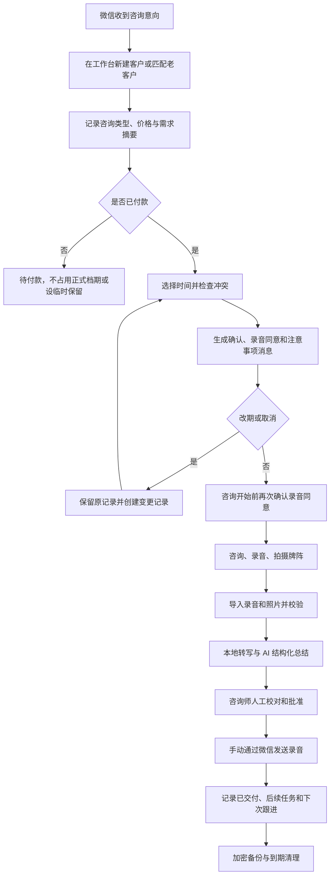

# 心塔·塔罗心理成长咨询数字化 AI 升级方案 V1.0

> 编制日期：2026-08-10  
> 方案状态：讨论稿，用于确认产品方向、首版范围和实施顺序  
> 暂定产品名：**心塔·咨询工作台**  
> 参考材料：用户提供的 13 页 PDF《如果继续按照现在的模式做，天花板会比较低。》

---

## 1. 一句话结论

这件事可做，而且她现有的 **两台 iPhone + MacBook Air M5 16GB+1TB** 足够启动，不需要先购买服务器。

最适合她的第一步不是立刻开发面向大量用户的“AI 心理陪伴平台”，而是先做一个 **单人咨询工作室的本地优先管理工具**：

- Mac 负责客户档案、咨询排期、录音照片归档、本地 AI 处理和备份；
- 服务 iPhone 继续负责微信沟通和视频咨询；
- 第二台 iPhone 在获得客户明确同意后负责独立录音和咨询现场拍照；
- AI 只做转写、整理、检索和草稿，不直接替她给客户下判断；
- 所有 AI 结果必须由她确认后才能进入正式档案或发给客户；
- 首版不抓取微信、不自动发送微信、不自动操作收款，避免账号风险和隐私风险。

这个系统先把她目前的时间消耗和资料混乱问题解决，再逐步发展成 PDF 里设想的内容、会员和 AI 成长产品。

---

## 2. 现状、问题与待确认项

### 2.1 已知现状

- 获客主要依靠熟人转介绍；
- 有一个专门用于服务的微信号，以及一个个人微信号；
- 约 90% 的咨询通过微信在线视频完成；
- 客户先沟通、付款，再预约时间；
- 咨询期间全程录音，结束后将录音发给客户；
- 客户改期或取消时，需要人工重新安排；
- 会积累客户资料、咨询录音、塔罗牌照片和咨询记录；
- 目前缺少统一的客户时间线、排期、资料归档和复盘工具。

### 2.2 当前核心痛点

1. 微信聊天、付款、预约、录音、照片和咨询记录分散在不同位置。
2. 改期和取消容易造成遗漏、重复预约或口径不一致。
3. 每次复访前需要重新翻聊天和听录音，准备时间长。
4. 录音只完成“交付”，没有沉淀为可检索、可复盘的内容资产。
5. 客户越来越多后，仅靠记忆和微信置顶无法稳定管理。
6. 咨询资料高度敏感，一旦随意上云或误发，后果较重。

### 2.3 开发前必须向她确认

- 当前每周咨询量、平均时长和复访比例；
- 现行价格、付款确认方法、改期和取消规则；
- 是否已经有固定的录音同意话术；
- 录音、照片和文字档案希望保留多久；
- 是否服务未成年人；
- 她对外使用“塔罗咨询”“心理咨询”“心理成长”还是其他名称；
- 她是否具备与对外宣传相匹配的资质；
- 是否允许任何客户原始资料离开本地设备；
- 第二台 iPhone 是个人日常手机，还是可以在咨询时作为专用采集设备。

这些问题不会阻止原型设计，但会影响正式上线前的规则和合规文本。

---

## 3. 产品定位与边界

### 3.1 建议定位

**面向单人塔罗/心理成长咨询工作室的本地优先客户与咨询管理工具。**

它不是面向客户的聊天机器人，也不是医疗诊断系统。第一阶段的价值是：

- 少漏事：所有预约和资料进入同一条客户时间线；
- 少重复：AI 自动生成可校对的转写与摘要；
- 少翻找：通过客户、日期、主题、牌卡和标签快速检索；
- 更安全：原始录音和咨询资料默认只在本地；
- 可复盘：能看到复访、改期、收入结构和交付效率。

### 3.2 首版明确不做

- 不读取或监控个人微信聊天记录；
- 不模拟点击微信、批量加好友或自动群发；
- 不自动确认微信收款，以人工勾选“已付款”为准；
- 不自动给客户发送 AI 结论；
- 不让 AI 诊断抑郁、焦虑、人格障碍或其他精神障碍；
- 不默认把录音、照片、转写上传到公有云模型；
- 不在首版做客户社区、课程商城、直播、会员体系或 MR 疗愈空间；
- 不把塔罗牌结果包装成确定性的命运预测。

---

## 4. 推荐的设备分工

| 设备 | 建议职责 | 数据规则 |
|---|---|---|
| 服务 iPhone | 微信沟通、视频咨询、接收付款凭证、发送预约和交付消息 | 不作为长期档案库；微信里只保留业务沟通所需信息 |
| 第二台 iPhone | 在明确同意后独立录音、拍摄牌阵照片 | 导入 Mac 并校验成功后，按规则删除手机里的临时副本 |
| MacBook Air | 唯一主档案库、咨询排期、AI 转写总结、搜索、导出、备份 | 开启 FileVault；不与个人文件混存；自动锁定 |
| 加密外置 SSD（建议新增） | 本地加密备份和恢复 | 不能与 Mac 一起长期放置；定期做恢复演练 |

### 为什么建议双设备录音

微信视频通话中的直接内录会受系统、地区、微信版本和权限限制，不能把它当成稳定产品能力。建议继续采用更可控的方式：服务 iPhone 进行微信视频，第二台设备在客户同意后录制现场声音。

如果第二台 iPhone 是她的私人手机，应尽量避免长期保存客户录音；更稳妥的做法是录制结束后立即导入 Mac、核对时长和可播放性，再删除采集端副本及“最近删除”中的副本。

---

## 5. 完整服务流程

### 改期/取消必须保留历史

系统不能直接覆盖原时间。每一次调整都应记录：

- 原预约时间；
- 新预约时间；
- 变更发起方；
- 变更时间；
- 原因；
- 是否影响费用；
- 已发送给客户的消息版本；
- 操作者。

这样才能避免“到底约的是哪一天”的争议。

---

## 6. 功能范围与优先级

### P0：首版必须具备

| 模块 | 核心功能 |
|---|---|
| 今日工作台 | 今日咨询、待确认付款、待交付录音、待校对摘要、即将到期资料 |
| 客户管理 | 客户编号、微信昵称、联系方式、来源、标签、咨询历史、备注、风险提示 |
| 预约排期 | 日/周/月视图、冲突检查、付款状态、改期、取消、迟到、爽约、提醒 |
| 咨询记录 | 咨询类型、时长、价格、主题、牌卡、关键记录、后续任务 |
| 录音与照片 | 导入、播放、缩略图、哈希校验、客户绑定、版本与交付状态 |
| AI 工作台 | 录音转写、摘要草稿、行动项、关键词、时间戳证据、人工批准 |
| 微信消息模板 | 预约确认、付款提醒、改期确认、录音同意、咨询后交付、复访提醒 |
| 搜索 | 按客户、日期、标签、主题、牌卡和全文搜索 |
| 安全与备份 | 应用锁、权限、加密、备份状态、恢复检查、删除与导出 |
| 基础经营报表 | 咨询次数、收入记录、复访、改期/取消率、交付时效、来源分布 |

### P1：首版稳定后增加

- iPhone 采集伴侣 App：直接录音、拍照并安全传回 Mac；
- 客户预约链接：客户只看到可预约时段，不直接看到私人日历内容；
- 本地语义搜索和跨次咨询主题演变；
- 咨询前“一页简报”：上次主题、未完成事项、近期变化、风险提示；
- 咨询后回访任务与周期性复盘；
- 客户数据导出和自助删除申请流程；
- 匿名化内容素材库，把经授权且去身份化的共性主题转为选题草稿。

### P2：经营验证后再考虑

- 客户端成长记录；
- 付费会员、课程、冥想和群咨询；
- AI 日记或成长陪伴；
- 内容生产和多平台运营；
- 企业员工成长服务；
- VR/MR 疗愈空间。

P2 对应参考 PDF 中的长期想象，但不应成为首版负担。

---

## 7. 关键页面

### 7.1 今日工作台

打开应用后直接看到：

- 下一场咨询还有多久；
- 哪些客户已付款但未确认时间；
- 哪些预约等待改期；
- 哪些录音未导入、未转写或未交付；
- 哪些 AI 摘要待人工校对；
- 哪些客户需要回访；
- 备份是否正常。

### 7.2 日历与排期

- 支持日、周、月视图；
- 每条预约显示客户编号/昵称、状态、时长和是否付款；
- 创建或移动预约时自动检查时间冲突和缓冲时间；
- 支持设置咨询前后各 10-30 分钟缓冲；
- 可选写入 Apple 日历，但日历中只写客户编号或昵称，不写咨询主题；
- 不把她的私人日历内容复制进本系统。

### 7.3 客户详情

一页内按时间顺序呈现：

- 基本资料和来源；
- 同意书版本；
- 付款和预约历史；
- 每次咨询、录音、照片、牌卡和摘要；
- 改期、取消和交付记录；
- 待跟进事项；
- 数据导出和删除记录。

### 7.4 咨询工作区

- 咨询开始前：显示上次摘要和未完成事项；
- 咨询进行中：允许快速记关键词、牌名和正/逆位；
- 咨询结束后：导入录音与照片，启动本地 AI；
- AI 完成后：原文、摘要和证据时间戳并排校对；
- 只有点击“批准归档”后，摘要才成为正式记录。

---

## 8. 数据结构

| 对象 | 主要字段 |
|---|---|
| 客户 Client | 客户编号、称呼、微信昵称、联系方式、来源、标签、首次联系时间、状态 |
| 同意 Consent | 同意类型、文本版本、同意时间、撤回时间、适用范围、证据 |
| 预约 Appointment | 开始/结束时间、状态、服务类型、价格、付款状态、缓冲时间、变更历史 |
| 付款 PaymentRecord | 金额、币种、付款时间、确认方式、退款/抵扣状态、备注 |
| 咨询 Session | 预约关联、实际时长、咨询主题、手工记录、牌卡、行动项、交付状态 |
| 媒体 MediaAsset | 类型、随机文件名、原始文件名、时长/尺寸、哈希、加密状态、导入来源 |
| AI 产物 AIArtifact | 模型、版本、提示词版本、转写、摘要、时间戳、生成时间、批准状态 |
| 跟进 FollowUp | 任务、截止时间、状态、关联客户/咨询 |
| 审计 AuditEvent | 谁在何时查看、修改、导出、删除了什么 |

### 文件命名规则

磁盘上的真实文件名不直接写客户姓名或咨询主题，建议使用随机 ID，例如：

`media/2026/08/8f3c2f...m4a`

应用界面再通过数据库显示“客户 C-0021 / 2026-08-10 / 第 3 次咨询”。即使文件被单独看到，也不容易直接识别客户。

---

## 9. 本地 AI 方案

### 9.1 先区分两类模型

**Qwen 不是录音转写模型。** 完整流程需要两类模型：

1. 语音识别模型：把 M4A/WAV 转成带时间戳的文字；
2. 语言模型：基于文字做结构化整理、摘要、标签和检索。

### 9.2 推荐模型组合

| 任务 | 推荐 | 备用 | 结论 |
|---|---|---|---|
| 中文录音转写 | whisper.cpp + Whisper medium 或 large-v3-turbo，按真实录音测试 | 更小的 Whisper 模型 | Apple 芯片可本地运行；准确率受录音质量影响很大 |
| 咨询摘要与结构化提取 | Qwen3-4B-Instruct-2507 的可信 4-bit 量化版本 | Qwen3-0.6B | 4B 更适合作为主总结器，0.6B 用于快速标签或低耗模式 |
| 图片文字识别 | Apple Vision 本地 OCR | 手工录入 | 适合牌名、手写标签等可见文字，不保证识别牌面含义 |
| 牌卡识别 | 首版手工选择牌名和正/逆位 | 后续本地图像匹配 | 先保证准确，不在首版依赖视觉大模型猜牌 |
| 搜索 | SQLite 全文检索 | 后续本地向量检索 | 首版先做稳定的关键词搜索 |

### 9.3 Mac 能不能带动

**能。** 16GB 统一内存和 1TB 存储足以支撑单用户本地应用、数据库、Whisper 转写和小型量化语言模型。

但需要区分“能运行”和“达到可用质量”：

- Qwen3-0.6B 运行负担很低，但对 60-90 分钟咨询的复杂人物关系、前后因果和细节总结可能不够稳；
- 4B 量化模型更适合作为正式摘要草稿模型，仍然需要人工校对；
- 长录音应在咨询结束后进入队列，依次执行转写和总结，不同时加载多个大模型；
- 不直接把 90 分钟全文一次性扔给模型，而是“分段提取事实 -> 分层汇总 -> 最终摘要”；
- 应限制上下文长度，避免内存交换和无意义的长输出；
- 实际速度、温度和耗电必须在她自己的 Mac 上用真实录音测试后确认。

### 9.4 真实设备模型选型测试

准备 10 段已获授权或彻底匿名化的历史录音，覆盖：

- 安静和有背景噪声；
- 普通话、口音、语速快、两人重叠说话；
- 30、60、90 分钟；
- 不同咨询主题；
- 明确出现日期、金额、人名、牌名和后续约定。

每个候选组合记录：

- 总处理时间；
- 内存压力和交换空间增长；
- Mac 是否明显发热或卡顿；
- 转写错字、漏句和说话人混淆；
- 摘要是否漏掉关键事实；
- 是否出现原文中不存在的内容；
- 她对摘要可用性的 1-5 分评价。

通过标准建议：

- 20 个抽检样本中不得出现虚构的关键事实；
- 清晰录音中的日期、金额、预约和行动项提取准确率达到 95% 以上；
- 关键结论都能回到原文时间戳；
- 80% 以上的摘要被她评为 4 分或 5 分；
- 处理期间应用不崩溃，系统内存压力保持可接受；
- 断电或退出后任务可以继续，不重复覆盖原始文件。

若 0.6B 达不到标准，就只保留为标签工具；若 4B 仍不稳定，应优化分段和模板，而不是盲目换更大的模型。

### 9.5 AI 摘要固定格式

每次咨询的 AI 草稿建议固定为：

1. 本次咨询基本信息；
2. 客户主动表达的主要问题；
3. 关键事件与时间线；
4. 客户描述的感受和关注点；
5. 本次使用的牌卡、正/逆位及当时讨论；
6. 咨询师提供的观点和追问；
7. 客户自己作出的决定；
8. 已约定的行动项和下次跟进；
9. 需要人工确认的矛盾或不确定信息；
10. 证据时间戳。

AI 不得擅自补全未说出的背景，不得把情绪描述升级为医学诊断，不得替咨询师生成确定性命运判断。

---

## 10. 录音、照片与交付 SOP

### 10.1 咨询前

1. 预约确认消息中单独说明录音目的、保存位置、用途和保留期限；
2. 让客户明确选择“同意录音/不同意录音”；
3. 再单独选择“同意本地 AI 转写整理/不同意 AI 处理”；
4. 不同意录音时，仍应提供不录音的服务路径；
5. 咨询开始时再次口头确认，并把确认时间记录在系统中。

### 10.2 咨询中

- 服务 iPhone 开启微信视频并稳定放置；
- 录音设备开启勿扰模式并确认剩余电量和空间；
- 先录 10 秒测试，确认双方声音可辨；
- 只录音，不录无必要的视频画面；
- 牌阵照片尽量只拍牌面，不拍客户头像、聊天界面或付款信息；
- 在应用中手工选择牌名和正/逆位，避免 AI 误识别。

### 10.3 咨询后

1. 录音通过 AirDrop 或采集伴侣 App 导入 Mac；
2. 系统校验文件能播放、时长合理、哈希已生成；
3. 原始文件只读归档，后续处理使用副本；
4. 启动本地转写和摘要；
5. 她逐项校对并批准；
6. 系统导出“客户交付副本”，由她手动通过微信发送；
7. 标记发送时间和确认状态；
8. 备份成功后，按规则清理采集端临时副本。

系统绝不能因为“导入按钮已点”就显示成功，必须完成可播放性、时长和哈希校验。

---

## 11. 预约、付款、改期和微信协作

### 11.1 预约状态

建议统一为：

`意向 -> 待付款 -> 待确认 -> 已预约 -> 进行中 -> 已完成 -> 待交付 -> 已交付`

异常分支：

`申请改期 / 已改期 / 已取消 / 迟到 / 爽约 / 退款 / 余额保留`

### 11.2 付款

首版不接微信支付接口，使用人工确认：

- 金额；
- 付款时间；
- 她确认付款的方式；
- 是否退款或转为下次余额；
- 备注。

付款截图不是必存项。能通过金额和时间核对时，不应额外长期保存包含微信账号、头像和交易号的截图。

### 11.3 微信消息模板

系统只生成可复制文本，由她检查后发送。建议至少包含：

- 首次咨询说明；
- 价格和付款说明；
- 预约确认；
- 咨询前 24 小时提醒；
- 录音和本地 AI 处理同意；
- 改期申请确认；
- 取消与费用处理；
- 咨询后录音交付；
- 回访提醒。

消息模板必须有版本号。改期规则或保留期限变化后，旧客户记录仍能看到当时使用的原版本。

### 11.4 Apple 日历

应用可申请“仅写入”日历权限，把已确认预约写入专用日历。事件标题只使用客户编号或业务昵称，例如：

`咨询 C-0021 / 60 分钟`

不在系统日历里写感情问题、家庭冲突、牌卡结果等敏感主题。

---

## 12. 隐私、合规与服务边界

> 本节是产品设计底线，不替代律师或合规专业人士的正式意见。上线前应根据实际服务性质、所在地和资质复核。

### 12.1 为什么要按敏感资料设计

咨询录音、文字转写、照片、关系经历、健康信息和付款信息可能直接或间接识别客户，其中部分内容属于或接近敏感个人信息。系统应按更严格的标准保护，而不是等发生问题再补。

### 12.2 同意必须覆盖

- 收集哪些资料；
- 为什么收集；
- 本地保存在哪里；
- 保存多久；
- 谁可以查看；
- 是否使用本地 AI 转写与整理；
- 是否将录音副本通过微信发回；
- 如何撤回同意、导出或删除；
- 如果未来调用云端 AI，必须再次单独说明并重新同意。

建议将“录音”“牌阵照片”“本地 AI 处理”“匿名化内容使用”做成四个独立选项，不能用一个总勾选框全部打包。

### 12.3 未成年人

如服务未满 14 周岁者，应暂停自动进入普通流程，先取得监护人相应同意并制定单独规则。没有完成规则和合规复核前，首版建议不接未成年人资料。

### 12.4 心理服务表达边界

如果她不是在具备相应资质的医疗机构中提供精神障碍诊断和治疗，产品、宣传和 AI 输出都不应使用：

- “诊断”“治疗抑郁症”“治愈焦虑症”等医疗表述；
- 精神障碍结论；
- 替代医疗或危机干预的承诺；
- 保证改变结果、保证复合、保证改运等确定性承诺。

更稳妥的方向是“心理成长、情绪觉察、决策陪伴、关系梳理、塔罗投射工具”，并明确它不替代医疗服务。

### 12.5 危机信息

如果转写中出现自伤、伤人或其他高风险表达：

- AI 只能标记“需要人工立即复核”；
- 不自动下诊断；
- 不自动向任何人发送资料或报警；
- 由她按事先制定的人工危机流程处理；
- 系统记录她已查看和采取的动作。

在正式接入此功能前，应先由专业人士制定危机处理流程和本地紧急资源清单。

---

## 13. 安全、备份与删除

### 13.1 本机安全

- Mac 开启 FileVault；
- 应用首次打开需要独立密码或 Touch ID；
- 闲置 5-10 分钟自动锁定；
- 加密密钥保存在系统钥匙串，不写入配置文件；
- 数据库和媒体目录使用应用专属权限；
- 原始文件只读，修改产生新版本；
- 导出、删除、恢复和查看敏感资料写入审计日志；
- 错误日志不得记录客户姓名、完整转写或原始提示词内容；
- 本地模式下，处理原始资料时不应产生外部网络请求。

### 13.2 备份建议

最低配置：

1. Mac 内置盘上的主数据；
2. 一块加密外置 SSD 上的加密 Time Machine 或应用备份；
3. 条件允许时，再增加一份离线、异地保存的加密备份。

每月随机抽取一个客户做恢复演练：确认数据库、录音、照片、转写和摘要都能恢复。只有“备份任务显示完成”而从未恢复过，不算验证成功。

### 13.3 保留与删除

建议由她选择明确期限，而不是永久保存。可配置的初始规则示例：

- 临时导入副本：校验和备份后 7 天清理；
- AI 中间文件：正式摘要批准后 30 天清理；
- 原始录音、转写、照片：按客户同意的期限保存，例如 12 个月；
- 付款和经营记录：按实际经营与财税要求另行确定；
- 删除后进入 30 天加密回收区，再执行不可恢复清理；
- 客户撤回同意时，系统生成待处理任务并记录完成证据。

具体期限应在正式上线前完成法律和经营复核。

---

## 14. 容量估算

以“只保存音频，不保存整场视频”为前提：

- 1 小时压缩音频通常约几十 MB；
- 每周 10 次、每年 500 次咨询，原始音频大致为几十 GB/年；
- 照片、转写、摘要和数据库通常远小于视频；
- 加上工作副本、模型和缓存，建议按 **50-100GB/年** 做保守容量规划；
- 1TB 内置盘足够首阶段使用，但应始终保留至少 20%-25% 的空闲空间；
- 如果保存视频而不是音频，容量会快速上升，不建议作为默认方案。

外置盘不是为了扩容主库，而是为了可恢复的独立备份。

---

## 15. 实施路线

### 阶段 0：规则与样本验证（3-5 个工作日）

交付：

- 当前工作流程图；
- 客户字段和预约状态确认；
- 改期/取消规则；
- 录音与 AI 同意文本初稿；
- 10 段匿名化测试音频；
- Qwen 0.6B 与 4B、不同 Whisper 模型的测试报告；
- 数据保留和备份决策。

**阶段 0 不导入正式客户全量资料。**

### 阶段 1：Mac MVP（约 3-4 周）

第 1 周：客户、预约、付款状态、咨询记录和本地数据库。  
第 2 周：录音照片导入、文件校验、客户时间线、搜索和消息模板。  
第 3 周：本地转写、Qwen 摘要、人工校对和交付状态。  
第 4 周：加密、应用锁、备份恢复、删除流程、经营报表和试用修正。

### 阶段 2：小范围真实试用（2-4 周）

- 只选择她本人和少量已同意客户；
- 原有微信和手工记录保留，不立即停止；
- 每次记录节省时间、错误、AI 修改量和异常；
- 达到验收标准后，再迁移存量客户。

### 阶段 3：iPhone 采集伴侣（约 2-3 周）

- 配对 Mac；
- 录音和拍照；
- 明确显示录音状态；
- 本地网络加密传输；
- 断点续传和导入校验；
- Mac 确认备份后，提示清理手机临时副本。

### 阶段 4：经营增长功能

只有内部工作台连续稳定使用至少 2-3 个月后，再评估预约链接、会员、内容生产和客户侧 AI 产品。

---

## 16. MVP 验收标准

### 16.1 业务效率

- 2 分钟内完成新客户和首次预约；
- 1 分钟内完成改期，并自动保留原记录；
- 30 秒内找到某客户过去的录音、照片和摘要；
- 时间冲突必须阻止确认，不能只弹出弱提醒；
- 录音导入失败时不得显示成功；
- 咨询完成后能清楚看到“未转写/待校对/待交付/已交付”；
- 每次咨询前可一键生成上次咨询简报。

### 16.2 AI 质量

- 所有 AI 输出默认标记为“草稿”；
- 未经人工批准不能进入正式摘要；
- 每条关键事实可回到原文时间戳；
- 日期、金额、预约和行动项的抽检准确率达到约定标准；
- 不把客户描述改写成医学诊断；
- 失败、超时和中断可以恢复，不覆盖原始资料。

### 16.3 安全与恢复

- FileVault 已开启；
- 未解锁应用无法查看客户列表或文件缩略图；
- 关闭网络后，本地转写和总结仍能工作；
- 监测不到原始录音、转写和摘要向外部服务发送；
- 从外置备份完整恢复一个测试客户；
- 删除测试能清理数据库索引、媒体和派生文件；
- 导出和删除均有审计记录。

---

## 17. 经营数据看板

首版只看真正能帮助经营决策的数据：

- 本周/月咨询次数；
- 已预约时长与可用时段；
- 收款、退款和余额保留；
- 新客户/复访客户；
- 转介绍来源；
- 改期率、取消率和爽约率；
- 从咨询结束到录音交付的平均时间；
- 每次咨询的准备、整理和交付耗时；
- AI 草稿平均需要修改多少；
- 哪些服务类型复访率更高。

不建议用 AI 给客户打“稳定度”“人格价值”“付费意愿”等隐性分数。这类标签既容易误导，也会增加不必要的隐私风险。

---

## 18. 技术实施建议（给开发者）

### 18.1 推荐架构

- **首版客户端**：原生 macOS SwiftUI 应用；
- **第二阶段客户端**：原生 iOS 采集伴侣；
- **数据库**：SQLite，敏感字段使用可靠的数据库或字段加密方案；
- **媒体存储**：应用私有目录、随机文件名、哈希校验、版本不可覆盖；
- **密钥**：Keychain；
- **日历**：EventKit，仅申请完成任务所需的最小权限；
- **图片 OCR**：Apple Vision；
- **语音转写**：whisper.cpp，优先使用 Metal/Core ML 能力；
- **语言模型**：MLX-LM 或 llama.cpp，本地监听仅限回环地址；
- **搜索**：SQLite FTS5；
- **任务队列**：转码、转写、摘要、备份相互独立，可暂停、重试和续跑；
- **网络策略**：默认无云端推理；任何外部请求必须可见、可关闭、可审计。

### 18.2 不建议首版使用浏览器网页作为唯一形态

网页原型可以快速验证界面，但正式资料库更适合放在原生 Mac 应用中：

- 文件、钥匙串、Touch ID、日历和本地模型整合更自然；
- 不需要在局域网公开服务端口；
- 不依赖 Mac 常驻一个浏览器页面；
- 更容易限制应用对客户资料的访问范围。

### 18.3 关键工程要求

- 数据迁移必须有版本号和回滚前备份；
- 原始媒体写入后不可覆盖；
- AI 模型、量化来源、哈希和提示词版本进入审计记录；
- 所有时间以带时区的统一格式存储；
- 每次改期产生新事件，不直接覆盖旧值；
- 所有导入先进入隔离区，校验通过后再归档；
- 自动清理必须先生成清单，经过规则检查后执行；
- 测试数据不得使用真实客户姓名和历史敏感内容；
- 发布前做无网络运行测试、备份恢复测试和意外退出测试。

---

## 19. 成本判断

### 可以沿用

- 两台 iPhone；
- MacBook Air M5 16GB+1TB；
- 微信现有服务号/个人号工作方式；
- 开源本地模型和本地推理框架。

### 建议新增

- 1-2TB 可靠外置 SSD，用于加密备份；
- 如第二台 iPhone 不能作为咨询采集设备，可再评估独立录音设备；
- 上线前的隐私/服务边界专业复核。

### 首版可避免

- 云服务器；
- 按量付费的大模型 API；
- 微信自动化工具；
- 复杂 CRM 订阅；
- 高端 GPU 电脑；
- 小程序和多端完整客户端同时开发。

开源模型不等于没有成本，仍需核对许可证、模型来源、更新维护和安全修复。

---

## 20. 主要风险与对策

| 风险 | 后果 | 对策 |
|---|---|---|
| 客户未明确同意录音或 AI 处理 | 隐私与信任风险 | 分开同意、版本留存、咨询开始再次确认 |
| 微信内录不稳定 | 丢失录音 | 双设备录音、开始前 10 秒测试、导入后校验 |
| AI 摘要编造或漏掉事实 | 错误档案和误导 | 时间戳证据、固定模板、人工批准、抽检 |
| 0.6B 模型质量不足 | 摘要返工更多 | 0.6B 只做轻任务，4B 作为主模型并实测 |
| 电脑损坏或丢失 | 客户资料丢失/泄露 | FileVault、应用锁、外置加密备份、恢复演练 |
| 个人与服务资料混在一起 | 误发和权限混乱 | 服务设备分工、客户编号、应用私有目录 |
| 改期直接覆盖原预约 | 争议和漏约 | 完整状态机与变更历史 |
| 过早做面向客户的 AI 陪伴 | 成本、责任和范围失控 | 先做内部工作台，稳定使用后再评估 |
| 宣传越过服务资质边界 | 法律与品牌风险 | 弱化诊断治疗承诺，正式上线前专业复核 |

---

## 21. 建议的下一步

### 第一步：一场 90 分钟需求访谈

让她现场演示一名客户从“第一次微信联系”到“咨询后发录音”的完整过程，记录每个工具、字段、复制粘贴和容易忘记的节点。

### 第二步：完成 10 段匿名录音基准测试

用她的真实设备比较不同 Whisper 和 Qwen 配置，形成速度、内存、准确率和可用性报告，再锁定模型。不要先凭感觉决定一定用 0.6B 或 4B。

### 第三步：做可点击原型

只做六个页面：今日、日历、客户、咨询、AI 校对、设置与备份。她确认工作顺序后再写正式应用。

### 第四步：开发 Mac MVP

先用少量测试资料通过完整验收，再试点真实客户；在备份和删除机制通过前，不迁移历史全量录音。

---

## 22. 与参考 PDF 的关系

参考 PDF 提出的“弱化纯神秘学包装、强化心理成长和决策陪伴，并逐步发展内容、AI 产品和会员”的长期方向有价值。但其三年和十万用户设想远高于当前业务成熟度。

本方案做了三点收敛：

1. 先解决现有服务流程，而不是先做大众 AI 产品；
2. 先把客户资料变成安全、可复用的内部资产；
3. 先验证她是否愿意长期使用、客户是否接受、AI 是否真的节省时间，再扩展品牌和增长功能。

顺序建议为：

`服务数字化 -> 资料结构化 -> AI 提效 -> 经营数据化 -> 内容资产化 -> 客户侧产品化`

---

## 23. 参考资料

- [中华人民共和国个人信息保护法 - 中国人大网](https://www.npc.gov.cn/npc/c2/c30834/202108/t20210820_313088.html)
- [中华人民共和国精神卫生法 - 国家卫生健康委员会](https://www.nhc.gov.cn/fzs/c100048/201808/5d03e37b37c944b08d701a0b5722160a.shtml)
- [Qwen3-0.6B 官方模型卡](https://huggingface.co/Qwen/Qwen3-0.6B)
- [Qwen3-4B-Instruct-2507 官方模型卡](https://huggingface.co/Qwen/Qwen3-4B-Instruct-2507)
- [MLX-LM - Apple Silicon 本地语言模型框架](https://github.com/ml-explore/mlx-lm)
- [whisper.cpp - Apple Silicon 本地语音识别](https://github.com/ggml-org/whisper.cpp)
- [Apple：使用 FileVault 保护 Mac 数据](https://support.apple.com/zh-cn/guide/mac-help-cn/mh11785/mac)
- [Apple：加密外置存储设备](https://support.apple.com/zh-cn/guide/mac-help/mh40593/mac)
- [Apple：iPhone 通话录音和听写文本](https://support.apple.com/zh-cn/guide/personal-safety/ipsfa513e1a6/web)
- [Apple Developer：EventKit 日历访问](https://developer.apple.com/documentation/eventkit/accessing-calendar-using-eventkit-and-eventkitui)
- [Apple Developer：Vision 文字识别](https://developer.apple.com/documentation/vision/recognizetextrequest)

---

## 24. 最终建议

**立项，但按“小而稳、本地优先、人工把关”的方式立项。**

第一版只追求一件事：她每天打开一个应用，就能清楚知道今天见谁、是否付款、是否同意录音、资料在哪里、AI 整理到哪一步、录音是否已交付、下次该跟进什么。

如果这个闭环真正跑顺，她的服务效率、客户体验和资料资产都会明显提升；之后再做 PDF 里更大的品牌、内容、会员和 AI 成长产品，成功概率会高得多。
