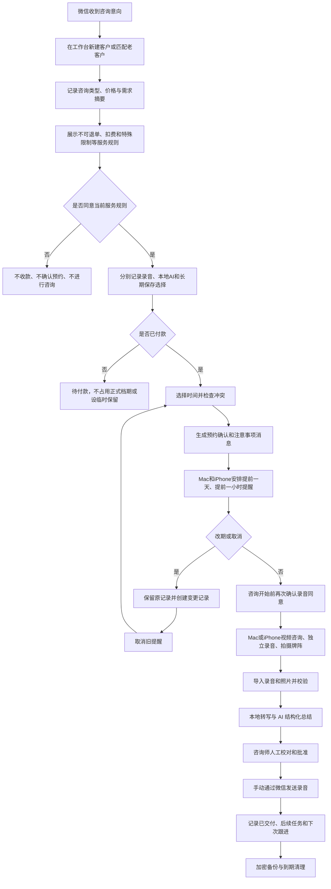

# 心塔·心理成长工作室数字化 AI 升级方案 V1.1

> 编制日期：2026-08-10  
> 方案状态：讨论稿，用于确认产品方向、首版范围和实施顺序  
> 暂定产品名：**心塔·咨询工作台**  
> 参考材料：用户提供的 13 页 PDF《如果继续按照现在的模式做，天花板会比较低。》及“心塔心理咨询”报价单长图（20260810-190403.jpeg）  
> V1.1 更新：纳入真实服务目录、Mac+iPhone 双视频咨询、双端预约提醒，并补充长期保存告知建议稿与开发前责任分类

---

## 1. 一句话结论

这件事可做，而且她现有的 **两台 iPhone + MacBook Air M5 16GB+1TB** 足够启动，不需要先购买服务器。

最适合她的第一步不是立刻开发面向大量用户的“AI 心理陪伴平台”，而是先做一个 **单人咨询工作室的本地优先管理工具**：

- Mac 负责客户档案、咨询排期、录音照片归档、本地 AI 处理和备份，同时是正式的微信视频咨询终端；
- 服务 iPhone 负责微信沟通，同时也是与 Mac 并列的正式视频咨询终端；后续优先安装配套应用接收移动提醒；
- 第二台 iPhone 在获得客户明确同意后负责独立录音和咨询现场拍照，可选作为提醒备用设备；
- 已确认预约默认在 Mac 和后续 iPhone 配套应用中生成“提前一天”和“提前一小时”两次提醒；
- AI 只做转写、整理、检索和草稿，不直接替她给客户下判断；
- 所有 AI 结果必须由她确认后才能进入正式档案或发给客户；
- 首版不抓取微信、不自动发送微信、不自动操作收款，避免账号风险和隐私风险。

这个系统先把她目前的时间消耗和资料混乱问题解决，再逐步发展成 PDF 里设想的内容、会员和 AI 成长产品。

---

## 2. 现状、问题与待确认项

### 2.1 已知现状

- 获客主要依靠熟人转介绍；
- 有一个专门用于服务的微信号，以及一个个人微信号；
- 约 90% 的咨询通过微信在线视频完成；
- 客户先沟通、付款，再预约时间；
- 咨询期间全程录音，结束后将录音发给客户；
- 客户改期或取消时，需要人工重新安排；
- 会积累客户资料、咨询录音、塔罗牌照片和咨询记录；
- 目前缺少统一的客户时间线、排期、资料归档和复盘工具。

### 2.2 报价单反映出的真实业务

报价单使用“心塔心理咨询”品牌，服务人员称为“彦子导师/多维能量整合师”。宣传材料自述的身份包括专业塔罗解读师、国家二级心理咨询师、注册情绪疗愈师和高级健康管理师，并自述有长期从业及大量案例经验。

这些属于**宣传材料自述**。应用可以保存证书名称、证书图片、颁发单位、编号、有效期和“待核验/已核验”状态，但不能仅凭宣传图片自动显示为平台认证。

#### 当前服务目录

| 类别 | 服务项目 | 形式/时长 | 当前价格或计价方式 |
|---|---|---|---|
| 咨询疗愈系列 | 单项精细化心理分析 | 视频，约 30-40 分钟 | 666 元 |
| 咨询疗愈系列 | 双项深度心理剖析 | 视频，约 60 分钟 | 1111 元 |
| 咨询疗愈系列 | 全年运势整合套餐 | 视频，约 90-100 分钟 | 1666 元 |
| 咨询疗愈系列 | 单次疗愈整合 | 视频，约 70 分钟 | 999 元 |
| 周期疗愈套餐 | 季度能量净化套餐 | 共 4 次，每次 60-90 分钟，含赠送项目 | 3999 元 |
| 周期疗愈套餐 | 全年定制陪伴成长计划 | 共 11 次，每次 60-90 分钟，含赠送项目 | 11000 元 |
| 老客户服务 | 极速问题解决通道 | 累计咨询 3 次以上；20 分钟；非视频；4 个以内具体问题 | 368 元 |
| 起名/改名 | 新生儿命名规划 | 定制项目 | 2777 元起 |
| 起名/改名 | 青少年改名赋能（1-17 岁） | 定制项目 | 2222 元起 |
| 起名/改名 | 成人改名焕新 | 定制项目 | 4444 元起 |
| 起名/改名 | 商业实体命名 | 定制项目 | 11111 元起 |
| 空间服务 | 场域能量净化赋新 | 上门或远程项目 | 18888 元起 |
| 空间服务 | 3D 场域能量重构 | 远程/项目制，包含 3D 效果图 | 18888 元起 |
| 空间服务 | 私人定制能量场域装修设计 | 项目制 | 300 元/㎡ |

#### 当前预约规则

- 预约时提供姓名、阳历出生日期和咨询项目，并缴付咨询费用；
- 可预约时间为 10:00-12:00、16:00-20:00；
- 宣传材料写明“预约后不可退单，可更改时间”；
- 改期应最晚于咨询前一天告知，否则扣除 200 元；
- 有空位时可支付 200 元加急费提前；
- 咨询须由本人进行，不做替第三方咨询；
- 材料还列有环境、清醒状态、问题类型和部分健康状态限制。

#### 对应用范围的直接影响

1. 不能只设计“单次咨询”，还要支持套餐总次数、剩余次数、赠送项目和有效期。
2. 起名、空间服务属于项目型订单，需要报价、资料、里程碑、交付物和尾款状态，不能硬塞进普通预约。
3. “元起”和“元/㎡”需要支持定制报价、面积、调整记录和报价版本。
4. 服务项目、价格和规则都必须版本化；旧订单保留成交当时的价格与规则。
5. 出生日期、未成年人资料和健康限制可能涉及敏感信息，只能按必要性收集并设置单独同意。

### 2.3 当前核心痛点

1. 微信聊天、付款、预约、录音、照片和咨询记录分散在不同位置。
2. 改期和取消容易造成遗漏、重复预约或口径不一致。
3. 每次复访前需要重新翻聊天和听录音，准备时间长。
4. 录音只完成“交付”，没有沉淀为可检索、可复盘的内容资产。
5. 客户越来越多后，仅靠记忆和微信置顶无法稳定管理。
6. 咨询资料高度敏感，一旦随意上云或误发，后果较重。

### 2.4 已知配置、她需要提供的材料与项目组可拟定内容

#### 已从现有材料获得，直接进入初始配置

- 14 个服务项目及其分类；
- 单次服务的标准时长和价格；
- 3999 元季度套餐的 4 次权益，以及 11000 元年度计划的 11 次权益；
- 老客户快速通道的准入条件、20 分钟时长和 368 元价格；
- 起名、改名、空间服务的起价或面积单价；
- 可预约时间：10:00-12:00、16:00-20:00；
- 预约后不可退单、可以改期；
- 晚于咨询前一天改期扣除 200 元；
- 有空位时加急费 200 元；
- 咨询须由本人进行；
- Mac 和服务 iPhone 都可能用于正式视频咨询；
- 默认提醒时间为咨询前 24 小时和 1 小时，首版只提醒她本人；
- 已有固定的录音同意和本地 AI 处理同意话术；
- 当前经营决定为：经客户明确选择同意后，录音、照片、转写和正式摘要长期保存，不预设自动到期日；
- 不提供未成年人咨询；青少年改名服务必须由监护人提起；
- 对外最终定位使用“心理成长”；
- 所有客户资料首阶段只做本地处理，云服务后期另行评估；
- “不可退单”、扣费和特殊人群限制在付款前告知，客户明确同意后才收款和提供咨询。
- 现有《咨询须知与流程》已经包含不可退单、晚于咨询前一天改期扣 200 元、加急费 200 元、本人咨询及特殊人群/问题限制等告知文本。

开发访谈中不再逐项询问价格、标准时长和上述预约规则，只需让她确认这张报价单是否仍是当前有效版本，并记录版本生效日期。

#### A. 必须由她提供或确认的事实与原始材料

- 当前每周实际咨询量、复访比例和不同服务的实际成交占比；
- 收到微信付款后，她目前用什么方式确认并记录；
- 固定的录音同意和本地 AI 处理话术原文及当前版本号；
- 当前《咨询须知与流程》的原始清晰文件，并确认其版本号、生效日期及是否仍全部有效；
- 报价单中的资质、年限、案例数和相关服务文案是否有可核验材料；
- 第二台 iPhone 是个人日常手机，还是可以在咨询时作为专用录音设备；
- 周期套餐的有效期、延期、赠送项目使用和退款/转让规则；
- 起名和空间项目的首款、尾款、资料清单及交付验收规则；
- 客户拒绝长期保存时，她是否愿意采用本方案建议的限期保留替代流程；
- 她实际经营所在地、收款主体和对外签约主体，供专业人士判断适用规则。

#### B. 项目组可以先拟定、再由她确认的内容

- “客户资料长期保存告知与同意”文本，见 12.3 节建议稿；
- 客户不同意长期保存时的替代保留期限和删除流程；
- 服务规则、录音、本地 AI、长期保存四类文本的展示顺序、确认界面和证据格式；
- 套餐有效期、延期、转让、次数调整等规则的备选方案和利弊；
- 项目订单的资料清单、里程碑、验收确认和逾期提醒模板；
- 付款确认、预约确认、改期确认、咨询后交付等微信消息模板；
- 数据导出、撤回同意、删除申请、备份清理和处理时限的内部操作流程；
- 危机信息人工处理流程初稿及系统需要记录的动作。

以上内容可以由产品方案先给出推荐默认值，但最终必须由她确认后才能成为正式业务规则。

#### C. 不能只由她或开发者自行决定、上线前需要专业复核的内容

- “预约后不可退单”、改期扣费和加急收费是否符合实际交易场景及消费者权益要求；
- 月经、怀孕、重症等特殊人群限制的必要性、表达方式和健康信息收集范围；
- 长期保存录音、照片、转写和正式摘要的必要性、同意方式及删除例外；
- 报价单中的资质、疗愈效果和其他对外宣传表述；
- 高风险信息、争议订单、删除请求和依法必须保留资料时的处理规则。

因此，现有告知文本不再列为“等她补写”的材料；项目组负责整理、版本化并提出修改建议，她负责确认真实业务意图，涉及法律与专业边界的部分再交由相应专业人士复核。这些事项不会阻止原型设计，但会影响正式上线版本。

---

## 3. 产品定位与边界

### 3.1 建议定位

**面向单人心理成长工作室的本地优先客户与咨询管理工具。塔罗作为她使用的分析与沟通工具之一。**

它不是面向客户的聊天机器人，也不是医疗诊断系统。第一阶段的价值是：

- 少漏事：所有预约和资料进入同一条客户时间线；
- 少重复：AI 自动生成可校对的转写与摘要；
- 少翻找：通过客户、日期、主题、牌卡和标签快速检索；
- 更安全：原始录音和咨询资料默认只在本地；
- 可复盘：能看到复访、改期、收入结构和交付效率。

### 3.2 首版明确不做

- 不读取或监控个人微信聊天记录；
- 不模拟点击微信、批量加好友或自动群发；
- 不自动确认微信收款，以人工勾选“已付款”为准；
- 不自动给客户发送 AI 结论；
- 不让 AI 诊断抑郁、焦虑、人格障碍或其他精神障碍；
- 不默认把录音、照片、转写上传到公有云模型；
- 不在首版做客户社区、课程商城、直播、会员体系或 MR 疗愈空间；
- 不把塔罗牌结果包装成确定性的命运预测。

---

## 4. 推荐的设备分工

| 设备 | 建议职责 | 数据规则 |
|---|---|---|
| 服务 iPhone | 微信沟通、正式视频咨询、接收付款凭证、发送预约和交付消息；后续安装配套应用接收提醒 | 不作为长期档案库；微信里只保留业务沟通所需信息 |
| 第二台 iPhone | 在明确同意后独立录音、拍摄牌阵照片；可选开启备用提醒 | 导入 Mac 并校验成功后，按规则删除手机里的临时副本 |
| MacBook Air | 唯一主档案库、咨询排期、正式微信视频咨询、本地 AI、搜索、导出、备份 | 开启 FileVault；不与个人文件混存；自动锁定 |
| 加密外置 SSD（建议新增） | 本地加密备份和恢复 | 不能与 Mac 一起长期放置；定期做恢复演练 |

### 为什么建议双设备录音

微信视频通话中的直接内录会受系统、地区、微信版本和权限限制，不能把它当成稳定产品能力。无论使用服务 iPhone 还是 Mac 进行微信视频，都建议让第二台 iPhone 在客户同意后独立录制现场声音。

如果第二台 iPhone 是她的私人手机，应尽量避免长期保存客户录音；更稳妥的做法是录制结束后立即导入 Mac、核对时长和可播放性，再删除采集端副本及“最近删除”中的副本。

### Mac 与 iPhone 双视频咨询模式

Mac 和服务 iPhone 都可能承担正式视频咨询，不预设固定主次。每次预约增加“本次咨询设备”选项：`Mac / 服务 iPhone / 待确定`。她可以根据地点、网络、设备状态和个人习惯选择，并在咨询开始前临时切换。

- **使用 Mac**：屏幕更大，可在旁边打开客户时间线和咨询工作区；第二台 iPhone 负责独立录音；
- **使用服务 iPhone**：适合移动或临时场景；第二台 iPhone 或放置在旁边的 Mac 负责独立录音；
- **临时切换**：只修改本次咨询的设备字段，不新建预约、不重复核销套餐、不重复生成提醒；
- **无论使用哪台设备**：咨询记录、录音、照片和 AI 摘要最终都归档到 Mac 主档案库。

工作台应提供“进入咨询模式”：

- 显示客户编号、服务项目、预计时长、是否付款、录音和 AI 同意状态；
- 打开咨询前检查清单：网络、供电、摄像头、麦克风、录音设备、勿扰模式；
- 可打开微信，但不模拟点击客户、不自动发起视频；
- 默认隐藏其他客户姓名和敏感通知，避免共享屏幕或镜头误露；
- 咨询过程中支持快速记牌名、正/逆位、关键词和待跟进事项；
- Mac 或服务 iPhone 出现异常时，可切换到另一台设备，不改变该次预约、付款、套餐核销和资料绑定；
- 录音仍由独立设备完成，不把 Mac 系统音频抓取作为首版依赖。

---

## 5. 完整服务流程

### 改期/取消必须保留历史

系统不能直接覆盖原时间。每一次调整都应记录：

- 原预约时间；
- 新预约时间；
- 变更发起方；
- 变更时间；
- 原因；
- 是否影响费用；
- 已发送给客户的消息版本；
- 操作者。

这样才能避免“到底约的是哪一天”的争议。

---

## 6. 功能范围与优先级

### P0：首版必须具备

| 模块 | 核心功能 |
|---|---|
| 今日工作台 | 今日咨询、待确认付款、待交付录音、待校对摘要、即将到期资料 |
| 客户管理 | 客户编号、微信昵称、联系方式、来源、标签、咨询历史、备注、风险提示 |
| 服务目录 | 单次服务、套餐、定制报价、价格/规则版本、启用/停用状态 |
| 规则与同意 | 付款前展示服务规则；录音、本地 AI、长期保存分别确认；保存每份文本版本、选择和确认时间 |
| 套餐权益 | 总次数、已使用、剩余次数、赠送项目、有效期、延期与调整记录 |
| 预约排期 | 日/周/月视图、冲突检查、付款状态、改期、取消、迟到、爽约、Mac 提醒及后续 iPhone 同步 |
| 咨询记录 | 咨询类型、时长、价格、主题、牌卡、关键记录、后续任务 |
| 录音与照片 | 导入、播放、缩略图、哈希校验、客户绑定、版本与交付状态 |
| AI 工作台 | 录音转写、摘要草稿、行动项、关键词、时间戳证据、人工批准 |
| 提醒中心 | 默认提前一天和提前一小时提醒她本人；显示 Mac/日历/后续 iPhone 状态 |
| 微信消息模板 | 服务规则告知、录音、本地 AI、长期保存、预约确认、付款说明、改期确认、咨询后交付、复访 |
| 搜索 | 按客户、日期、标签、主题、牌卡和全文搜索 |
| 安全与备份 | 应用锁、权限、加密、备份状态、恢复检查、删除与导出 |
| 基础经营报表 | 咨询次数、收入记录、复访、改期/取消率、交付时效、来源分布 |

### P1：首版稳定后增加

- iPhone 配套 App：接收预约同步和本地提醒，直接录音、拍照并安全传回 Mac；
- 客户预约链接：客户只看到可预约时段，不直接看到私人日历内容；
- 起名、改名和空间项目订单：资料清单、报价、首/尾款、里程碑和交付物；
- 本地语义搜索和跨次咨询主题演变；
- 咨询前“一页简报”：上次主题、未完成事项、近期变化、风险提示；
- 咨询后回访任务与周期性复盘；
- 客户数据导出和自助删除申请流程；
- 匿名化内容素材库，把经授权且去身份化的共性主题转为选题草稿。

### P2：经营验证后再考虑

- 客户端成长记录；
- 付费会员、课程、冥想和群咨询；
- AI 日记或成长陪伴；
- 内容生产和多平台运营；
- 企业员工成长服务；
- VR/MR 疗愈空间。

P2 对应参考 PDF 中的长期想象，但不应成为首版负担。

---

## 7. 关键页面

### 7.1 今日工作台

打开应用后直接看到：

- 下一场咨询还有多久；
- 明天和一小时内有哪些预约、当前已启用设备的提醒是否成功安排；
- 哪些客户已付款但未确认时间；
- 哪些预约等待改期；
- 哪些录音未导入、未转写或未交付；
- 哪些 AI 摘要待人工校对；
- 哪些客户需要回访；
- 备份是否正常。

### 7.2 日历与排期

- 支持日、周、月视图；
- 每条预约显示客户编号/昵称、状态、时长和是否付款；
- 每条视频预约可选择 `Mac / 服务 iPhone / 待确定`，并允许在开始前切换；
- 创建或移动预约时自动检查时间冲突和缓冲时间；
- 支持设置咨询前后各 10-30 分钟缓冲；
- 已确认预约默认生成提前 24 小时和提前 1 小时两次提醒；
- 改期时先撤销旧时间的提醒，再创建新提醒；取消后不得继续提醒；
- 预约卡显示“Mac 已安排/iPhone 已同步/日历备份已写入”状态；
- 可选写入 Apple 日历，但日历中只写客户编号或昵称，不写咨询主题；
- 不把她的私人日历内容复制进本系统。

### 7.3 客户详情

一页内按时间顺序呈现：

- 基本资料和来源；
- 同意书版本；
- 付款和预约历史；
- 每次咨询、录音、照片、牌卡和摘要；
- 改期、取消和交付记录；
- 待跟进事项；
- 数据导出和删除记录。

### 7.4 咨询工作区

- 咨询开始前：显示上次摘要和未完成事项；
- 根据预约选择显示“使用 Mac 咨询”或“使用 iPhone 咨询”的对应检查清单；
- 咨询进行中：允许快速记关键词、牌名和正/逆位；
- 咨询结束后：导入录音与照片，启动本地 AI；
- AI 完成后：原文、摘要和证据时间戳并排校对；
- 只有点击“批准归档”后，摘要才成为正式记录。

### 7.5 提醒中心

首版提醒对象只包括咨询师本人，不创建客户提醒任务，也不自动向客户发送任何消息：

- **提前一天**：提醒她确认客户、付款、设备、网络、录音同意和是否需要改期；
- **提前一小时**：提醒她确认本次使用 Mac 还是 iPhone，打开客户简报、准备牌卡、检查对应设备和独立录音设备并进入勿扰模式；
- 点开提醒可选择“打开预约”“稍后提醒”“标记已准备”；
- 锁屏文案只显示客户编号和时间，不显示咨询主题、健康信息或关系问题；
- 提醒时间可按服务项目覆盖，但 24 小时和 1 小时为系统默认值；
- 如果 iPhone 尚未同步，Mac 必须显示明显警告，不能假装双端提醒已经生效。

---

## 8. 数据结构

| 对象 | 主要字段 |
|---|---|
| 客户 Client | 客户编号、称呼、微信昵称、联系方式、来源、标签、首次联系时间、状态 |
| 同意 Consent | 同意类型、文本版本、同意时间、撤回时间、适用范围、证据 |
| 服务规则确认 PolicyAcceptance | 服务规则版本、不可退单/改期扣费/特殊限制、展示时间、客户确认时间、确认方式 |
| 服务项目 ServiceItem | 分类、名称、形式、标准时长、定价方式、当前价格、规则版本、启用状态 |
| 套餐 Package | 包含次数、赠送项目、有效期、适用服务、价格版本、使用规则 |
| 客户权益 ClientEntitlement | 购买套餐、总次数、已用/剩余次数、有效期、延期和人工调整记录 |
| 预约 Appointment | 开始/结束时间、状态、服务类型、成交价格、付款状态、视频设备（Mac/iPhone/待定）、切换记录、缓冲时间、变更历史 |
| 付款 PaymentRecord | 金额、币种、付款时间、确认方式、退款/抵扣状态、备注 |
| 咨询 Session | 预约关联、实际时长、咨询主题、手工记录、牌卡、行动项、交付状态 |
| 提醒 Reminder | 预约版本、触发时间、设备、类型、同步状态、送达/处理状态、撤销时间 |
| 项目订单 ProjectOrder | 起名/空间项目、报价版本、面积、首/尾款、资料清单、里程碑、交付物、验收状态 |
| 媒体 MediaAsset | 类型、随机文件名、原始文件名、时长/尺寸、哈希、加密状态、导入来源 |
| AI 产物 AIArtifact | 模型、版本、提示词版本、转写、摘要、时间戳、生成时间、批准状态 |
| 跟进 FollowUp | 任务、截止时间、状态、关联客户/咨询 |
| 审计 AuditEvent | 谁在何时查看、修改、导出、删除了什么 |

### 文件命名规则

磁盘上的真实文件名不直接写客户姓名或咨询主题，建议使用随机 ID，例如：

`media/2026/08/8f3c2f...m4a`

应用界面再通过数据库显示“客户 C-0021 / 2026-08-10 / 第 3 次咨询”。即使文件被单独看到，也不容易直接识别客户。

---

## 9. 本地 AI 方案

### 9.1 先区分两类模型

**Qwen 不是录音转写模型。** 完整流程需要两类模型：

1. 语音识别模型：把 M4A/WAV 转成带时间戳的文字；
2. 语言模型：基于文字做结构化整理、摘要、标签和检索。

### 9.2 推荐模型组合

| 任务 | 推荐 | 备用 | 结论 |
|---|---|---|---|
| 中文录音转写 | whisper.cpp + Whisper medium 或 large-v3-turbo，按真实录音测试 | 更小的 Whisper 模型 | Apple 芯片可本地运行；准确率受录音质量影响很大 |
| 咨询摘要与结构化提取 | Qwen3-4B-Instruct-2507 的可信 4-bit 量化版本 | Qwen3-0.6B | 4B 更适合作为主总结器，0.6B 用于快速标签或低耗模式 |
| 图片文字识别 | Apple Vision 本地 OCR | 手工录入 | 适合牌名、手写标签等可见文字，不保证识别牌面含义 |
| 牌卡识别 | 首版手工选择牌名和正/逆位 | 后续本地图像匹配 | 先保证准确，不在首版依赖视觉大模型猜牌 |
| 搜索 | SQLite 全文检索 | 后续本地向量检索 | 首版先做稳定的关键词搜索 |

### 9.3 Mac 能不能带动

**能。** 16GB 统一内存和 1TB 存储足以支撑单用户本地应用、数据库、Whisper 转写和小型量化语言模型。

但需要区分“能运行”和“达到可用质量”：

- Qwen3-0.6B 运行负担很低，但对 60-90 分钟咨询的复杂人物关系、前后因果和细节总结可能不够稳；
- 4B 量化模型更适合作为正式摘要草稿模型，仍然需要人工校对；
- 长录音应在咨询结束后进入队列，依次执行转写和总结，不同时加载多个大模型；
- 不直接把 90 分钟全文一次性扔给模型，而是“分段提取事实 -> 分层汇总 -> 最终摘要”；
- 应限制上下文长度，避免内存交换和无意义的长输出；
- 实际速度、温度和耗电必须在她自己的 Mac 上用真实录音测试后确认。

### 9.4 真实设备模型选型测试

准备 10 段已获授权或彻底匿名化的历史录音，覆盖：

- 安静和有背景噪声；
- 普通话、口音、语速快、两人重叠说话；
- 30、60、90 分钟；
- 不同咨询主题；
- 明确出现日期、金额、人名、牌名和后续约定。

每个候选组合记录：

- 总处理时间；
- 内存压力和交换空间增长；
- Mac 是否明显发热或卡顿；
- 转写错字、漏句和说话人混淆；
- 摘要是否漏掉关键事实；
- 是否出现原文中不存在的内容；
- 她对摘要可用性的 1-5 分评价。

通过标准建议：

- 20 个抽检样本中不得出现虚构的关键事实；
- 清晰录音中的日期、金额、预约和行动项提取准确率达到 95% 以上；
- 关键结论都能回到原文时间戳；
- 80% 以上的摘要被她评为 4 分或 5 分；
- 处理期间应用不崩溃，系统内存压力保持可接受；
- 断电或退出后任务可以继续，不重复覆盖原始文件。

若 0.6B 达不到标准，就只保留为标签工具；若 4B 仍不稳定，应优化分段和模板，而不是盲目换更大的模型。

### 9.5 AI 摘要固定格式

每次咨询的 AI 草稿建议固定为：

1. 本次咨询基本信息；
2. 客户主动表达的主要问题；
3. 关键事件与时间线；
4. 客户描述的感受和关注点；
5. 本次使用的牌卡、正/逆位及当时讨论；
6. 咨询师提供的观点和追问；
7. 客户自己作出的决定；
8. 已约定的行动项和下次跟进；
9. 需要人工确认的矛盾或不确定信息；
10. 证据时间戳。

AI 不得擅自补全未说出的背景，不得把情绪描述升级为医学诊断，不得替咨询师生成确定性命运判断。

---

## 10. 录音、照片与交付 SOP

### 10.1 咨询前

1. 预约确认消息中单独说明录音目的、保存位置、用途和保留期限；
2. 让客户明确选择“同意录音/不同意录音”；
3. 再单独选择“同意本地 AI 转写整理/不同意 AI 处理”；
4. 不同意录音时，仍应提供不录音的服务路径；
5. 咨询开始时再次口头确认，并把确认时间记录在系统中。

### 10.2 咨询中

- 根据场景选择 Mac 微信或服务 iPhone 开启视频咨询；
- 使用 Mac 时，把工作台和微信分区摆放并关闭无关通知，避免误露其他客户资料；
- 使用服务 iPhone 时，确认电量、支架、网络、勿扰模式，并在旁边设备上准备独立录音；
- 录音设备开启勿扰模式并确认剩余电量和空间；
- 先录 10 秒测试，确认双方声音可辨；
- 只录音，不录无必要的视频画面；
- 牌阵照片尽量只拍牌面，不拍客户头像、聊天界面或付款信息；
- 在应用中手工选择牌名和正/逆位，避免 AI 误识别。

### 10.3 咨询后

1. 录音通过 AirDrop 或采集伴侣 App 导入 Mac；
2. 系统校验文件能播放、时长合理、哈希已生成；
3. 原始文件只读归档，后续处理使用副本；
4. 启动本地转写和摘要；
5. 她逐项校对并批准；
6. 系统导出“客户交付副本”，由她手动通过微信发送；
7. 标记发送时间和确认状态；
8. 备份成功后，按规则清理采集端临时副本。

系统绝不能因为“导入按钮已点”就显示成功，必须完成可播放性、时长和哈希校验。

---

## 11. 预约、付款、改期和微信协作

### 11.1 服务目录、套餐与项目订单

报价单中的当前项目应作为初始服务目录录入，而不是写死在程序代码中。每个项目需要：

- 服务名称、分类、视频/非视频/项目制；
- 标准时长或面积计价方式；
- 标准价、起价或单价；
- 可预约时段和缓冲时间；
- 是否允许加急、改期和退款；
- 套餐包含次数、赠送项目和有效期；
- 服务说明和注意事项版本；
- 启用、暂停或下架状态。

客户购买 3999 元季度套餐或 11000 元年度计划后，应自动生成客户权益，但每次核销必须绑定一条真实咨询记录。人工增加、扣减、延期或赠送次数必须写明原因并进入审计日志。

起名、改名和空间服务建立“项目订单”，不占用普通咨询次数。项目可以关联一次或多次沟通预约，但主要状态应为：

`意向 -> 待资料 -> 已报价 -> 待首款 -> 执行中 -> 待确认 -> 待尾款 -> 已交付 -> 已归档`

### 11.2 预约状态

建议统一为：

`意向 -> 待规则同意 -> 待付款 -> 待确认 -> 已预约 -> 进行中 -> 已完成 -> 待交付 -> 已交付`

异常分支：

`申请改期 / 已改期 / 已取消 / 迟到 / 爽约 / 退款 / 余额保留`

### 11.3 付款

首版不接微信支付接口，使用人工确认：

- 金额；
- 付款时间；
- 她确认付款的方式；
- 是否退款或转为下次余额；
- 备注。

系统必须先保存客户对当前版本“不可退单、改期扣费、特殊人群限制”等服务规则的明确同意，再进入待付款状态。录音、本地 AI 处理和长期保存不与服务规则共用一个总勾选框，而是分别展示、分别记录选择；其中长期保存被拒绝时，进入 12.3 节建议的限期保留替代流程，不自动等同于拒绝提供核心服务。没有服务规则同意记录时不能确认预约或开始咨询；如果客户提前转账，系统应标记为异常待处理，不能用付款事实反推客户已经同意规则。

付款截图不是必存项。能通过金额和时间核对时，不应额外长期保存包含微信账号、头像和交易号的截图。

### 11.4 微信消息模板

系统只生成可复制文本，由她检查后发送。建议至少包含：

- 首次咨询说明；
- 价格和付款说明；
- 预约确认；
- 录音和本地 AI 处理同意；
- 客户资料长期保存告知与选择；
- 改期申请确认；
- 取消与费用处理；
- 咨询后录音交付；
- 回访提醒。

咨询前 24 小时和 1 小时提醒在首版只发送到她自己的 Mac/iPhone，不创建客户消息任务。未来如需提醒客户，应作为单独功能重新确认发送渠道、同意和文案。

消息模板必须有版本号。改期规则或保留期限变化后，旧客户记录仍能看到当时使用的原版本。

### 11.5 Apple 日历

应用可申请“仅写入”日历权限，把已确认预约写入专用日历。事件标题只使用客户编号或业务昵称，例如：

`咨询 C-0021 / 60 分钟`

不在系统日历里写感情问题、家庭冲突、牌卡结果等敏感主题。

### 11.6 Mac 与 iPhone 双端提醒规则

1. 预约只有进入“已预约/已确认”后才生成提醒；待付款和待确认不生成正式提醒。
2. 默认在开始时间前 24 小时、1 小时分别提醒一次。
3. Mac 立即安排本地通知；iPhone 在收到最小化预约数据后独立安排本地通知，因此 Mac 关闭后 iPhone 仍可提醒。
4. 严格本地模式下，Mac 与 iPhone 通过配对后的加密本地连接同步；iPhone 未确认前，Mac 显示“未同步”。
5. 可选把仅含客户编号、时间和时长的事件写入专用 Apple 日历，并设置同样的两个闹钟作为备用渠道。
6. 改期时使用预约 ID 和版本号撤销所有旧通知，再创建新通知；取消预约时撤销全部待触发通知。
7. 两个设备恢复联网或重新打开应用时，重新核对未来 30 天预约与通知列表，清理重复或过期提醒。
8. 如果用户关闭了系统通知权限，工作台必须持续显示红色警告并提供检查入口。
9. Apple 的本地通知属于系统尽力投递，不应宣称绝对保证；双设备加日历备份是为了降低漏提醒概率。
10. 提醒日志区分“已安排、已同步、系统已送达、用户已处理”。未拿到系统证据时不得显示“已送达”。

---

## 12. 隐私、合规与服务边界

> 本节是产品设计底线，不替代律师或合规专业人士的正式意见。上线前应根据实际服务性质、所在地和资质复核。

### 12.1 为什么要按敏感资料设计

咨询录音、文字转写、照片、关系经历、健康信息和付款信息可能直接或间接识别客户，其中部分内容属于或接近敏感个人信息。系统应按更严格的标准保护，而不是等发生问题再补。

### 12.2 同意必须覆盖

- 收集哪些资料；
- 为什么收集；
- 本地保存在哪里；
- 保存多久；
- 谁可以查看；
- 是否使用本地 AI 转写与整理；
- 是否将录音副本通过微信发回；
- 如何撤回同意、导出或删除；
- 如果未来调用云端 AI，必须再次单独说明并重新同意。

建议将“录音”“牌阵照片”“本地 AI 处理”“长期保存”“匿名化内容使用”分别记录，不能用一个总勾选框全部打包，也不能默认勾选。

她已经有固定的录音同意和本地 AI 处理同意话术。开发阶段不重新创作业务话术，而是导入她提供的原文，设置版本号和生效日期；话术内容以后发生变化时，只对新版本重新取得同意，历史咨询保留当时使用的旧版本。

首阶段所有客户资料只在本地处理。以后若考虑云服务，应先明确云服务商、上传的数据种类、处理目的和保存方式，再更新告知文本并取得相应同意，不能因为系统升级而默认把历史资料上传。

### 12.3 客户资料长期保存告知与同意（建议稿）

不建议对客户使用“永久保存且不可删除”这一说法。更清楚、也更稳妥的表达是：**长期保存、不预设自动到期日，但客户仍可依法提出查阅、复制、更正、撤回同意或删除。**

以下文本可作为首版建议稿，正式启用前应结合实际经营主体和专业复核意见定稿：

> **客户资料长期保存告知与同意**
>
> 为了便于后续复访、持续了解你的个人成长过程、减少重复叙述，并向你提供历史咨询资料查询服务，在你明确同意的前提下，我们拟长期保存以下资料：
>
> 1. 咨询原始录音；
> 2. 咨询过程中拍摄的牌阵或塔罗牌照片；
> 3. 由本地语音识别生成的文字转写；
> 4. 经咨询师人工校对确认的正式摘要。
>
> 上述资料在当前阶段仅保存在咨询师使用的本地加密设备及加密备份中，不上传至云端 AI 或第三方云存储。资料仅用于你的咨询衔接、复盘、资料交付与查询，以及依法处理安全或服务争议；未经你另行明确同意，不用于广告、公开内容、案例宣传，也不提供给无关第三方。
>
> 资料将按“长期保存、不预设自动删除日期”处理。这不表示资料不可删除。你可以随时提出查阅、复制、更正、撤回长期保存同意或删除申请。收到申请后，我们会核对身份，并在 15 个工作日内完成可删除主数据和派生数据的处理；加密备份中的副本最迟在 30 日内随备份轮换清理。法律法规要求必须继续保存，或处理争议确有必要暂时保留的部分，将仅限于相应目的保存，并向你说明原因和预计处理方式。
>
> 请作出选择：
>
> - [ ] 我已阅读并同意上述资料长期保存安排。
> - [ ] 我不同意长期保存；请按限期保留方案处理我的资料。
>
> 客户称呼/编号：__________  确认日期：__________
>
> 告知文本版本：__________  确认方式：微信文字 / 电子勾选 / 其他可核验方式

建议的“不同意长期保存”替代方案为：录音在确认收到交付文件后 30 日删除；牌阵照片、转写和正式摘要在本次咨询完成后 90 日删除；如果客户更早提出删除申请，则按上述申请流程处理。**30 日、90 日、15 个工作日和备份 30 日都是产品建议默认值，不是已经确定的经营规则**，应由她和专业人士确认后再写入正式文本。

该同意应与录音同意、本地 AI 处理同意和《咨询须知与流程》分开保存。系统至少记录：完整告知文本、版本号、展示时间、客户选择、确认时间、确认方式、撤回时间、处理结果和证据。不得只保存一个“已同意”布尔值。

### 12.4 报价单内容的专项处理

- 报价单中的“国家二级心理咨询师”等资质表述应保存证书证据并人工核验，应用不能自行认证；
- “疗愈、能量清理、改变磁场、运势预测”等属于现有服务表达，系统可以原样保存为历史服务文案，但 AI 不得把它改写成医学疗效或确定性结果；
- 预约要求的姓名和阳历出生日期只进入相应服务资料，不自动扩散到日历、提醒和导出文件名；
- “青少年改名赋能（1-17 岁）”涉及未成年人，必须增加监护人、授权关系和单独同意；
- 报价单列出的月经、怀孕、重症等限制涉及健康信息。应用默认不建立醒目的客户标签，也不要求批量收集；只有确有必要时才单独询问、单独同意并限制访问；
- 当前“预约后不可退单”“改期晚于前一天扣 200 元”等规则应由专业人士复核后再上线，应用只执行已确认且已向客户展示的版本。
- 服务规则、不可退单、扣费和特殊人群限制必须在收款前完整展示；只有客户明确同意后，系统才允许进入待付款和咨询流程。

### 12.5 未成年人

她不提供未成年人咨询。系统应阻止未满 18 周岁的客户进入任何咨询类服务。

“青少年改名赋能”是独立的项目型服务，必须由监护人作为申请人发起，未成年人只是服务对象。系统分别记录监护人和未成年人，保存监护关系、监护人同意和项目资料，但不得因此为未成年人创建咨询预约。

### 12.6 心理服务表达边界

如果她不是在具备相应资质的医疗机构中提供精神障碍诊断和治疗，产品、宣传和 AI 输出都不应使用：

- “诊断”“治疗抑郁症”“治愈焦虑症”等医疗表述；
- 精神障碍结论；
- 替代医疗或危机干预的承诺；
- 保证改变结果、保证复合、保证改运等确定性承诺。

对外最终定位确定为“心理成长”。可使用“情绪觉察、决策陪伴、关系梳理、塔罗投射工具”等表达，并明确它不替代医疗服务。

### 12.7 危机信息

如果转写中出现自伤、伤人或其他高风险表达：

- AI 只能标记“需要人工立即复核”；
- 不自动下诊断；
- 不自动向任何人发送资料或报警；
- 由她按事先制定的人工危机流程处理；
- 系统记录她已查看和采取的动作。

在正式接入此功能前，应先由专业人士制定危机处理流程和本地紧急资源清单。

---

## 13. 安全、备份与删除

### 13.1 本机安全

- Mac 开启 FileVault；
- 应用首次打开需要独立密码或 Touch ID；
- 闲置 5-10 分钟自动锁定；
- 加密密钥保存在系统钥匙串，不写入配置文件；
- 数据库和媒体目录使用应用专属权限；
- 原始文件只读，修改产生新版本；
- 导出、删除、恢复和查看敏感资料写入审计日志；
- 错误日志不得记录客户姓名、完整转写或原始提示词内容；
- 本地模式下，处理原始资料时不应产生外部网络请求。

### 13.2 备份建议

最低配置：

1. Mac 内置盘上的主数据；
2. 一块加密外置 SSD 上的加密 Time Machine 或应用备份；
3. 条件允许时，再增加一份离线、异地保存的加密备份。

每月随机抽取一个客户做恢复演练：确认数据库、录音、照片、转写和摘要都能恢复。只有“备份任务显示完成”而从未恢复过，不算验证成功。

### 13.3 保留与删除

当前经营意向是：在客户明确选择同意后，将录音、照片、转写和正式摘要长期保存，不预设自动到期日。系统初始配置为：

- 临时导入副本：校验和备份后 7 天清理；
- AI 中间文件：正式摘要批准后 30 天清理；
- 已同意长期保存的原始录音、照片、转写和正式摘要：不安排自动删除，并记录客户同意的完整文本版本；
- 未同意长期保存的资料：进入 12.3 节的限期保留替代流程，期限以最终确认版本为准；
- 付款和经营记录：按实际经营与财税要求另行确定；
- 客户提出撤回同意或删除请求时，系统生成待处理任务，记录处理依据、结果和完成证据；
- 执行删除时同步处理数据库索引、媒体、派生文件和后续备份，不只隐藏界面记录。

这一经营决定必须在正式上线前完成专项合规复核。《个人信息保护法》第十九条要求个人信息保存期限原则上为实现处理目的所必要的最短时间，第四十七条还规定了应主动删除或响应删除请求的情形。因此“永久保留”不能被设计为不可撤回、不可删除；如果复核认为缺乏持续保存的必要性，应把长期保留改为明确期限或明确删除触发条件。

---

## 14. 容量估算

以“只保存音频，不保存整场视频”为前提：

- 1 小时压缩音频通常约几十 MB；
- 每周 10 次、每年 500 次咨询，原始音频大致为几十 GB/年；
- 照片、转写、摘要和数据库通常远小于视频；
- 加上工作副本、模型和缓存，建议按 **50-100GB/年** 做保守容量规划；
- 1TB 内置盘足够首阶段使用，但应始终保留至少 20%-25% 的空闲空间；
- 因部分客户资料可能长期保存，系统应在磁盘使用率达到 70% 和 80% 时分级提醒，并按年度重新预测剩余容量；
- 不能通过删除历史正式资料来临时腾空间；容量不足时应先扩展经过加密和验证的归档/备份方案；
- 如果保存视频而不是音频，容量会快速上升，不建议作为默认方案。

当前建议购买的外置盘只用于可恢复的独立备份，不能同时充当唯一扩容盘。未来如需建立历史归档库，应使用单独的加密存储方案，并为归档库再保留独立备份。

---

## 15. 实施路线

### 阶段 0：规则与样本验证（3-5 个工作日）

交付：

- 当前工作流程图；
- 客户字段和预约状态确认；
- 改期/取消规则；
- 导入现有录音同意和本地 AI 处理同意话术，并建立版本；
- 长期保存告知文本、限期保留替代流程和合规复核结论；
- 10 段匿名化测试音频；
- Qwen 0.6B 与 4B、不同 Whisper 模型的测试报告；
- 长期保存方案的合规复核及备份设计。

**阶段 0 不导入正式客户全量资料。**

### 阶段 1：Mac MVP（约 3-4 周）

第 1 周：客户、真实服务目录、套餐权益、预约、付款状态和本地数据库。

第 2 周：Mac 本地提醒、Apple 日历备用闹钟、后续双端同步数据结构、录音照片导入、搜索和消息模板。
第 3 周：本地转写、Qwen 摘要、人工校对和交付状态。  
第 4 周：加密、应用锁、备份恢复、删除流程、经营报表和试用修正。

### 阶段 2：小范围真实试用（2-4 周）

- 只选择她本人和少量已同意客户；
- 原有微信和手工记录保留，不立即停止；
- 每次记录节省时间、错误、AI 修改量和异常；
- 达到验收标准后，再迁移存量客户。

### 阶段 3：iPhone 配套应用（约 2-3 周）

- 配对 Mac；
- 同步最小化预约数据；
- 独立安排提前一天和提前一小时本地提醒；
- 显示提醒同步状态并处理改期/取消；
- 录音和拍照；
- 明确显示录音状态；
- 本地网络加密传输；
- 断点续传和导入校验；
- Mac 确认备份后，提示清理手机临时副本。

### 阶段 4：经营增长功能

只有内部工作台连续稳定使用至少 2-3 个月后，再评估预约链接、会员、内容生产和客户侧 AI 产品。

---

## 16. 分阶段验收标准

### 16.1 业务效率

- 2 分钟内完成新客户和首次预约；
- 1 分钟内完成改期，并自动保留原记录；
- 30 秒内找到某客户过去的录音、照片和摘要；
- 时间冲突必须阻止确认，不能只弹出弱提醒；
- 已确认预约在 Mac 生成提前 24 小时和 1 小时提醒；
- 选择 Apple 日历备用后，专用日历生成相同两次闹钟；
- 改期后旧时间不再提醒，新时间重新生成两次提醒；
- 取消后 Mac 和专用日历均不再触发；
- 锁屏提醒不得出现客户真实姓名、咨询主题或健康信息；
- 通知权限被关闭或日历写入失败时必须明确报警；
- 客户未确认当前版本的服务规则前，系统不能进入待付款、已预约或进行中状态；
- 服务规则、录音、本地 AI 处理和长期保存分别展示、分别记录，不得使用预先勾选的总同意；
- 客户不同意长期保存时，系统进入限期保留替代流程，不得误记为“已同意”或自动阻断核心服务；
- 系统保留每次告知的完整文本、版本、展示时间、客户选择、确认时间和确认方式；
- 未满 18 周岁的客户不能创建咨询预约；青少年改名订单必须绑定监护人申请人；
- 录音导入失败时不得显示成功；
- 咨询完成后能清楚看到“未转写/待校对/待交付/已交付”；
- 每次咨询前可一键生成上次咨询简报；
- 分别完成一次 Mac 视频流程和一次服务 iPhone 视频流程；两种流程都能关联同一套预约、付款、录音、摘要和交付状态；
- 咨询前从 Mac 切换到 iPhone，或从 iPhone 切换到 Mac，不得重复核销套餐、重复收费或生成重复档案；

### 16.2 iPhone 配套应用提醒

- 服务 iPhone 同步后生成提前 24 小时和 1 小时两次本地提醒；
- Mac 明确显示每台 iPhone 的同步版本和最后确认时间；
- 改期和取消后，iPhone 旧提醒被撤销；
- Mac 关闭后，已同步到 iPhone 的提醒仍可由 iPhone 本地触发；
- iPhone 离线或未同步时 Mac 明确报警，不能显示为成功；
- 如果两台 iPhone 都安装应用，可以分别开启或关闭提醒，避免无意的重复轰炸；
- 恢复连接后能够对账并清理重复、过期或旧版本通知。

### 16.3 AI 质量

- 所有 AI 输出默认标记为“草稿”；
- 未经人工批准不能进入正式摘要；
- 每条关键事实可回到原文时间戳；
- 日期、金额、预约和行动项的抽检准确率达到约定标准；
- 不把客户描述改写成医学诊断；
- 失败、超时和中断可以恢复，不覆盖原始资料。

### 16.4 安全与恢复

- FileVault 已开启；
- 未解锁应用无法查看客户列表或文件缩略图；
- 关闭网络后，本地转写和总结仍能工作；
- 监测不到原始录音、转写和摘要向外部服务发送；
- 从外置备份完整恢复一个测试客户；
- 删除测试能清理数据库索引、媒体和派生文件；
- 导出和删除均有审计记录；
- 录音、照片、转写和正式摘要默认不安排自动删除，同时能够受理并执行依法需要处理的撤回和删除请求；
- 客户资料在首阶段的网络审计中不得发送到任何云端 AI 或云存储服务。

---

## 17. 经营数据看板

首版只看真正能帮助经营决策的数据：

- 本周/月咨询次数；
- 已预约时长与可用时段；
- 收款、退款和余额保留；
- 新客户/复访客户；
- 转介绍来源；
- 改期率、取消率和爽约率；
- 从咨询结束到录音交付的平均时间；
- 每次咨询的准备、整理和交付耗时；
- AI 草稿平均需要修改多少；
- 哪些服务类型复访率更高。

不建议用 AI 给客户打“稳定度”“人格价值”“付费意愿”等隐性分数。这类标签既容易误导，也会增加不必要的隐私风险。

---

## 18. 技术实施建议（给开发者）

### 18.1 推荐架构

- **首版客户端**：原生 macOS SwiftUI 应用；
- **第二阶段客户端**：原生 iOS 采集伴侣；
- **本地提醒**：UserNotifications，Mac 和 iPhone 各自独立安排；
- **数据库**：SQLite，敏感字段使用可靠的数据库或字段加密方案；
- **媒体存储**：应用私有目录、随机文件名、哈希校验、版本不可覆盖；
- **密钥**：Keychain；
- **日历**：EventKit，仅申请完成任务所需的最小权限；可选创建专用日历及两个备用闹钟；
- **图片 OCR**：Apple Vision；
- **语音转写**：whisper.cpp，优先使用 Metal/Core ML 能力；
- **语言模型**：MLX-LM 或 llama.cpp，本地监听仅限回环地址；
- **搜索**：SQLite FTS5；
- **任务队列**：转码、转写、摘要、备份相互独立，可暂停、重试和续跑；
- **网络策略**：默认无云端推理；任何外部请求必须可见、可关闭、可审计。

提醒请求使用稳定标识，例如 `appointmentID + appointmentVersion + offset + device`。改期和取消时按标识撤销旧请求，不能仅靠标题或客户姓名匹配。iPhone 只同步客户编号、开始时间、时长、提醒规则和预约版本；咨询主题、录音和摘要不进入提醒同步包。

### 18.2 不建议首版使用浏览器网页作为唯一形态

网页原型可以快速验证界面，但正式资料库更适合放在原生 Mac 应用中：

- 文件、钥匙串、Touch ID、日历和本地模型整合更自然；
- 不需要在局域网公开服务端口；
- 不依赖 Mac 常驻一个浏览器页面；
- 更容易限制应用对客户资料的访问范围。

### 18.3 关键工程要求

- 数据迁移必须有版本号和回滚前备份；
- 原始媒体写入后不可覆盖；
- AI 模型、量化来源、哈希和提示词版本进入审计记录；
- 所有时间以带时区的统一格式存储；
- 每次改期产生新事件，不直接覆盖旧值；
- 视频设备切换只更新本次预约的设备与切换记录，不得触发重复收费、重复套餐核销或重复提醒；
- 自动化测试必须分别覆盖 Mac 视频、iPhone 视频以及咨询前临时切换三条路径；
- 所有导入先进入隔离区，校验通过后再归档；
- 自动清理必须先生成清单，经过规则检查后执行；
- 测试数据不得使用真实客户姓名和历史敏感内容；
- 发布前做无网络运行测试、备份恢复测试和意外退出测试。

---

## 19. 成本判断

### 可以沿用

- 两台 iPhone；
- MacBook Air M5 16GB+1TB；
- 微信现有服务号/个人号工作方式；
- 开源本地模型和本地推理框架。

### 建议新增

- 1-2TB 可靠外置 SSD，用于加密备份；
- 如第二台 iPhone 不能作为咨询采集设备，可再评估独立录音设备；
- 上线前的隐私/服务边界专业复核。

### 首版可避免

- 云服务器；
- 按量付费的大模型 API；
- 微信自动化工具；
- 复杂 CRM 订阅；
- 高端 GPU 电脑；
- 小程序和多端完整客户端同时开发。

开源模型不等于没有成本，仍需核对许可证、模型来源、更新维护和安全修复。

---

## 20. 主要风险与对策

| 风险 | 后果 | 对策 |
|---|---|---|
| 客户未明确同意录音或 AI 处理 | 隐私与信任风险 | 分开同意、版本留存、咨询开始再次确认 |
| 微信内录不稳定 | 丢失录音 | 双设备录音、开始前 10 秒测试、导入后校验 |
| AI 摘要编造或漏掉事实 | 错误档案和误导 | 时间戳证据、固定模板、人工批准、抽检 |
| 0.6B 模型质量不足 | 摘要返工更多 | 0.6B 只做轻任务，4B 作为主模型并实测 |
| 电脑损坏或丢失 | 客户资料丢失/泄露 | FileVault、应用锁、外置加密备份、恢复演练 |
| 个人与服务资料混在一起 | 误发和权限混乱 | 服务设备分工、客户编号、应用私有目录 |
| 改期直接覆盖原预约 | 争议和漏约 | 完整状态机与变更历史 |
| 改期后旧提醒未撤销 | 客户时间混乱 | 预约版本号、撤销旧请求、双端重建和定期对账 |
| Mac 已更新但 iPhone 未同步 | 移动端漏提醒 | 同步确认状态、明显警告、专用日历备用闹钟 |
| 锁屏显示敏感内容 | 隐私泄露 | 只显示客户编号、时间和通用文案 |
| 套餐次数人工计算 | 多算、少算或争议 | 权益台账、每次核销绑定咨询、人工调整留痕 |
| 未保留付款前的规则同意证据 | 退款和服务争议 | 规则版本、确认时间、确认方式；未同意不得进入待付款 |
| 长期保存全部正式资料 | 不符合最短必要原则的风险，且泄露影响持续累积 | 专项合规复核、明确告知、限期保留备选、撤回/删除流程、容量与安全年度复审 |
| 未成年人误进入咨询流程 | 违反当前经营规则并扩大敏感数据风险 | 咨询服务年龄门槛；青少年改名必须由监护人发起 |
| 后期启用云服务时默认上传历史资料 | 超出原同意范围 | 云能力独立立项、重新告知并取得相应同意、默认关闭 |
| 过早做面向客户的 AI 陪伴 | 成本、责任和范围失控 | 先做内部工作台，稳定使用后再评估 |
| 宣传越过服务资质边界 | 法律与品牌风险 | 弱化诊断治疗承诺，正式上线前专业复核 |

---

## 21. 建议的下一步

### 第一步：一场 90 分钟需求访谈

让她现场演示一名客户从“第一次微信联系”到“咨询后发录音”的完整过程，记录每个工具、字段、复制粘贴和容易忘记的节点。

### 第二步：完成 10 段匿名录音基准测试

用她的真实设备比较不同 Whisper 和 Qwen 配置，形成速度、内存、准确率和可用性报告，再锁定模型。不要先凭感觉决定一定用 0.6B 或 4B。

### 第三步：做可点击原型

先做七个页面：今日、日历、提醒中心、客户、咨询、AI 校对、设置与备份。用三种场景验收：正常预约、改期、取消。她确认工作顺序后再写正式应用。

### 第四步：开发 Mac MVP

先用少量测试资料通过完整验收，再试点真实客户；在备份和删除机制通过前，不迁移历史全量录音。

---

## 22. 与参考 PDF 的关系

参考 PDF 提出的“弱化纯神秘学包装、强化心理成长和决策陪伴，并逐步发展内容、AI 产品和会员”的长期方向有价值。但其三年和十万用户设想远高于当前业务成熟度。

本方案做了三点收敛：

1. 先解决现有服务流程，而不是先做大众 AI 产品；
2. 先把客户资料变成安全、可复用的内部资产；
3. 先验证她是否愿意长期使用、客户是否接受、AI 是否真的节省时间，再扩展品牌和增长功能。

V1.1 进一步根据报价单修正了一个重要判断：她的业务已经包含单次视频咨询、周期套餐、老客户快速服务、起名改名和空间项目。因此内部系统必须同时支持“预约型服务、套餐权益、项目型订单”三种业务对象，不能只做简单日历。

顺序建议为：

`服务数字化 -> 资料结构化 -> AI 提效 -> 经营数据化 -> 内容资产化 -> 客户侧产品化`

---

## 23. 参考资料

- [中华人民共和国个人信息保护法 - 中国人大网](https://www.npc.gov.cn/npc/c2/c30834/202108/t20210820_313088.html)
- [中华人民共和国精神卫生法 - 国家卫生健康委员会](https://www.nhc.gov.cn/fzs/c100048/201808/5d03e37b37c944b08d701a0b5722160a.shtml)
- [Qwen3-0.6B 官方模型卡](https://huggingface.co/Qwen/Qwen3-0.6B)
- [Qwen3-4B-Instruct-2507 官方模型卡](https://huggingface.co/Qwen/Qwen3-4B-Instruct-2507)
- [MLX-LM - Apple Silicon 本地语言模型框架](https://github.com/ml-explore/mlx-lm)
- [whisper.cpp - Apple Silicon 本地语音识别](https://github.com/ggml-org/whisper.cpp)
- [Apple：使用 FileVault 保护 Mac 数据](https://support.apple.com/zh-cn/guide/mac-help-cn/mh11785/mac)
- [Apple：加密外置存储设备](https://support.apple.com/zh-cn/guide/mac-help/mh40593/mac)
- [Apple：iPhone 通话录音和听写文本](https://support.apple.com/zh-cn/guide/personal-safety/ipsfa513e1a6/web)
- [Apple Developer：EventKit 日历访问](https://developer.apple.com/documentation/eventkit/accessing-calendar-using-eventkit-and-eventkitui)
- [Apple Developer：EventKit 事件闹钟](https://developer.apple.com/documentation/eventkit/setting-an-alarm)
- [Apple Developer：UserNotifications 本地通知](https://developer.apple.com/documentation/usernotifications/scheduling-a-notification-locally-from-your-app)
- [Apple Developer：Vision 文字识别](https://developer.apple.com/documentation/vision/recognizetextrequest)

---

## 24. 最终建议

**立项，但按“小而稳、本地优先、人工把关”的方式立项。**

第一版只追求一件事：她每天打开一个应用，就能清楚知道今天见谁、是否付款、是否同意录音、资料在哪里、AI 整理到哪一步、录音是否已交付、下次该跟进什么。

如果这个闭环真正跑顺，她的服务效率、客户体验和资料资产都会明显提升；之后再做 PDF 里更大的品牌、内容、会员和 AI 成长产品，成功概率会高得多。
